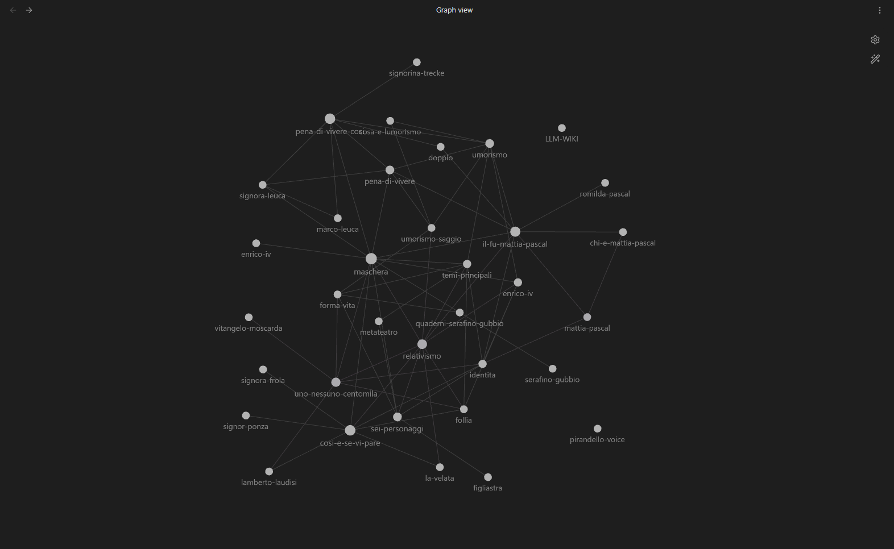

<p align="center">
  
</p>

**Pirandello Chatbot** è un chatbot RAG che risponde **come Luigi Pirandello** usando una wiki strutturata come knowledge base. Include un agente **Wiki Manager** che analizza testi e crea/aggiorna pagine wiki autonomamente.

Supporta provider LLM locali e cloud, sintesi vocale (TTS) con clonazione vocale, webapp React e app mobile Flutter.

## Architettura

```
backend/          ← FastAPI + Socket.IO (Python)
webapp/           ← React + Vite + Tailwind (browser)
mobile_app/       ← Flutter (Android/Windows/iOS)
wiki/pages/       ← 33+ pagine markdown su opere, personaggi, concetti
raw/articles/     ← Testi originali di Pirandello
```

### Stack

| Layer | Tecnologia |
|-------|-----------|
| **LLM** | Multi-provider (LM Studio, Ollama, OpenAI, Anthropic, Google, OpenRouter) |
| **TTS** | Coqui XTTS v2 (voce di Pirandello clonata) |
| **Backend** | Python 3.12+, FastAPI, Socket.IO |
| **Webapp** | React 19, Vite 8, Tailwind CSS v4 |
| **Mobile** | Flutter 3.41+, socket_io_client |
| **Wiki** | Markdown con frontmatter YAML, pagine indicizzate |

## Provider supportati

| Provider | Tipo | Configurazione |
|----------|------|----------------|
| **LM Studio** | Locale (OpenAI-compatibile) | URL: `http://localhost:1234/v1` |
| **Ollama** | Locale (OpenAI-compatibile) | URL: `http://localhost:11434/v1` |
| **llama.cpp** | Locale (OpenAI-compatibile) | URL: `http://localhost:8080/v1` |
| **OpenAI** | Cloud | API key + modello (es. `gpt-4o`) |
| **OpenRouter** | Cloud (multi-modello) | API key + modello (es. `openai/gpt-4o`) |
| **Anthropic** | Cloud (Claude) | API key + modello (es. `claude-sonnet-4-20250514`) |
| **Google Gemini** | Cloud | API key + modello (es. `gemini-2.0-flash`) |

**Configurazione rapida**: Configura i provider dall'interfaccia utente (Impostazioni → Provider)

## Come avviare

### Backend

```powershell
cd backend
pip install -r requirements.txt
python main.py
# → http://localhost:8000 — health su /health
```

O usa `start_backend.bat`.

### WebApp

```powershell
cd webapp
npm install
npm run dev
# → http://localhost:5173
```

O usa `start_webapp.bat`.

### Mobile App (Flutter)

```powershell
cd mobile_app
flutter pub get
flutter run -d windows    # Test su Windows
flutter build apk         # Build APK Android
```

L'APK si trova in `mobile_app/build/app/outputs/flutter-apk/`.

#### Connessione da telefono (Tailscale)

1. Installa [Tailscale](https://tailscale.com/) su PC e telefono, stesso account.
2. Avvia il backend sul PC (porta 8000).
3. Sul PC: `tailscale ip -4` → es. `100.64.x.x`
4. Nell'app mobile: **Impostazioni** → Server → IP Tailscale del PC → **Applica** → **Test connessione**.
5. Emulatore Android sullo stesso PC: usa `http://10.0.2.2:8000` (predefinito).

## Esempi di conversazione

<p align="center">
  
  <br/><em>WebApp — Chat con Pirandello</em>
</p>

<p align="center">
  
  <br/><em>App mobile Flutter</em>
</p>

## Esempi audio (TTS con voce clonata)

**Voce di base (riferimento):**
<audio controls>
  <source src="https://github.com/francescodemunari/Pirandello-wiki/raw/main/assets/pirandello_ref.wav" type="audio/wav">
</audio>

<br>

**Saluto iniziale:**
<audio controls>
  <source src="https://github.com/francescodemunari/Pirandello-wiki/raw/main/assets/audio-esempio-1.mp3" type="audio/mpeg">
</audio>
<em>"Il piacere è mio, Francesco: benvenuto in questo salotto dove si conversa, non si predica. La vita, come dicevo io, è una tragicommedia e forse oggi potremo ridere insieme di qualche sua maschera."</em>

<br>

**Sull'insegnamento:**
<audio controls>
  <source src="https://github.com/francescodemunari/Pirandello-wiki/raw/main/assets/audio-esempio-2.mp3" type="audio/mpeg">
</audio>
<em>"Sì, per vent'anni ho tenuto la cattedra di stilistica a Roma, ma devo dire che l'insegnamento mi appesantiva più di quanto non mi rallegrasse. Preferivo scrivere e recitare, dove la verità si svela nel gesto e nella parola, mentre in aula rischiavo sempre di cadere nell'ipocrisia delle forme rigide che cerco di smascherare nelle mie opere."</em>

## API

### REST

| Metodo | Path | Descrizione |
|--------|------|-------------|
| GET | `/health` | Stato server + provider attivo + conteggio wiki |
| GET | `/api/providers` | Elenco provider disponibili e attivo |
| POST | `/api/providers/activate?name=X` | Attiva un provider |
| POST | `/api/providers/config?name=X` | Aggiorna configurazione provider |
| GET | `/api/sessions` | Elenco sessioni |
| GET | `/api/sessions/{id}/messages` | Messaggi di una sessione |
| DELETE | `/api/sessions/{id}` | Elimina sessione |
| GET | `/api/memories` | Fatti memorizzati dall'utente |
| POST | `/upload` | Upload file multipart |

### Socket.IO

| Evento | Direzione | Descrizione |
|--------|-----------|-------------|
| `chat_message` | client → server | Invia messaggio con `{message, session_id, mode, provider}` |
| `token` | server → client | Token della risposta in streaming |
| `done` | server → client | Fine della risposta |
| `assistant_preparing` | server → client | Pre-generazione TTS in corso |
| `assistant_ready` | server → client | Risposta completa con audio |
| `request_tts` | client → server | Richiedi sintesi vocale |
| `tts_ready` | server → client | Audio TTS pronto |
| `upload_file` | client → server | Upload file in base64 |
| `upload_result` | server → client | Risultato upload |

## Variabili d'ambiente

Vedi `backend/.env.example` per tutte le opzioni disponibili.

```
# Provider attivo
ACTIVE_PROVIDER=lm_studio

# Provider locali
LM_STUDIO_URL=http://localhost:1234/v1
OLLAMA_URL=http://localhost:11434/v1
LLAMACPP_URL=http://localhost:8080/v1

# Provider cloud (API key richiesta)
OPENAI_API_KEY=sk-...
ANTHROPIC_API_KEY=sk-ant-...
GOOGLE_API_KEY=...
OPENROUTER_API_KEY=sk-or-...
```

## Screenshot Gallery

<p align="center">
  
</p>

<!-- Sostituisci con i tuoi screenshot:
<p align="center">
  
  <br/><em>WebApp — Chat con Pirandello</em>
</p>

<p align="center">
  
  <br/><em>WebApp — Impostazioni provider</em>
</p>

<p align="center">
  
  <br/><em>App mobile Flutter</em>
</p>
-->
